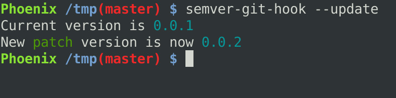
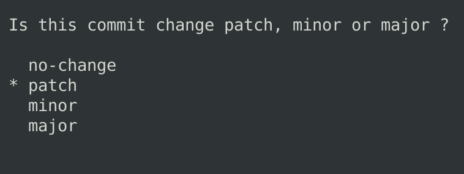

# Semver Git Hook

## Install

Works with python 3.6+

First, install the tool using python ecosystem :

```bash
pip install --user  semver-git-hook
```


## Use

Then set the hook in your current folder git repository :

```bash
semver-git-hook --init
```

That is all. Now on commit a release version type is asked interactively.





On commit some version change will be saved in a .version file. It is automatically added to the current commit.

With this enabled you have your project version set in the `.version` file that it is possible to dynamically load to your dev environment versionning settings.

For exemple in ptyhon the `setup.py` can look like

```python
# setup.py
with open('.version') as f:
    version = f.read()

setup(
    #...
    version=version,
    #...
)
```

and javascript


```javascript
//That can be a version.js file that is triggered in .git/hooks/pre-commit
const f = require('fs')
const version = f.readFileSync('.version', 'utf-8')
const package = JSON.parse(f.readFileSync('package.json', 'utf-8'))
package.version = version
f.writeFileSync('package.json', JSON.stringify(package, null, 4))
```

